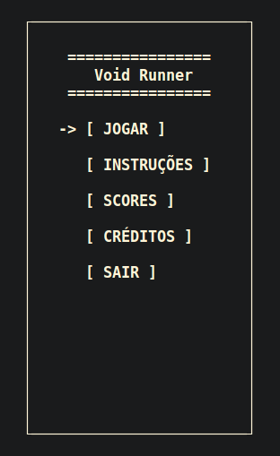

# Bem-vindo(a) ao repositório do Space Runner!

Space Runner é um jogo espacial emocionante, onde o jogador controla uma nave em um ambiente repleto de obstáculos perigosos e itens valiosos. O objetivo é destruir o máximo possível de obstáculos, coletar itens e sobreviver pelo maior tempo possível, acumulando pontos tanto pelas destruições quanto pela quantidade de itens coletados e pelo tempo de sobrevivência.

O jogador deve manobrar a nave para desviar dos obstáculos, movendo-se para a direita ou para a esquerda, enquanto tenta manter a nave intacta. A qualquer momento, uma colisão com um obstáculo resultará na perda do jogo.

# Imagens do Jogo

### Menu Inicial

<details>
  <summary>Clique para exibir</summary>



</details>

# Controles

### Menus

- **W**: Sobe uma opção no menu.
- **S**: Desce uma opção no menu.
- **A**: Move para a opção à esquerda.
- **D**: Move para a opção à direita.

### Durante o Jogo

- **Barra de espaço**: Atirar.
- **A**: Move a nave para a esquerda.
- **D**: Move a nave para a direita.

# Instruções de Compilação

O jogo foi desenvolvido utilizando o sistema operacional Linux (Ubuntu). Ele também é compatível com macOS, porém as instruções abaixo contemplam apenas a compilação para o Linux.

## Pré-requisitos

Certifique-se de que as ferramentas abaixo estejam instaladas no seu sistema:

### 1. GCC (GNU Compiler Collection)

O GCC é necessário para compilar o jogo. Para instalá-lo no Ubuntu, execute:

```bash
sudo apt update
sudo apt install build-essential
```

### 2. Git

O Git é necessário para clonar o repositório do jogo. Para instalá-lo no Ubuntu, execute:

```bash
sudo apt update
sudo apt install git
```

---

## Rodando a Aplicação

1. Clone o repositório:

```bash
git clone https://github.com/pedroguswander/GAME_PIF.git
```

2. No terminal, acesse a pasta raiz do projeto (GAME_PIF):

```bash
cd GAME_PIF
```

3. Compile o jogo:

```bash
gcc ./src/*.c -I./include -o game
```

4. Execute o jogo:

```bash
./game
```

---

# Equipe

- **Felipe Rêgo**
- **Fernando Cavalcanti**
- **Pedro Gusmão**

---

Sinta-se à vontade para contribuir ou relatar problemas na seção de Issues! Divirta-se jogando Space Runner! 🚀
